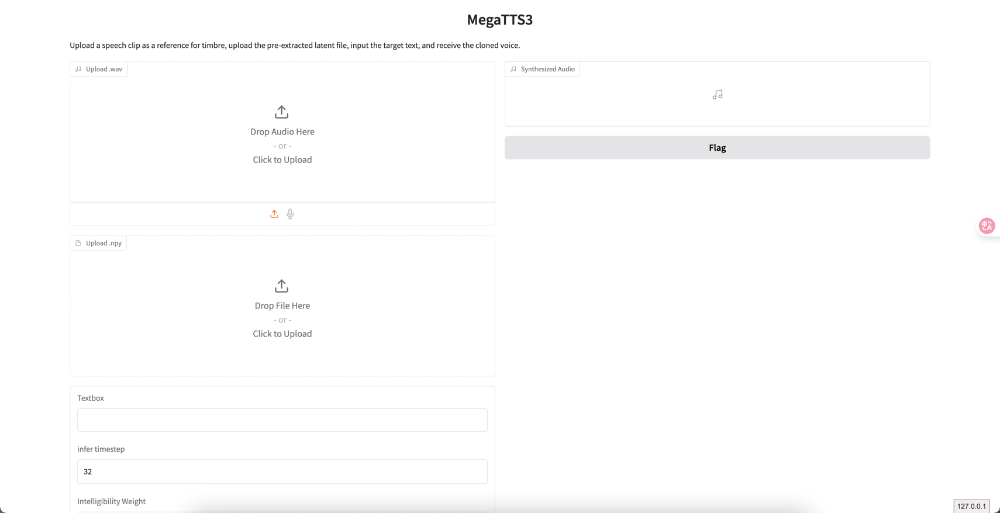

- https://github.com/bytedance/MegaTTS3

这是字节开源的一个TTS模型，支持中文、英文、日文、韩文等多种语言。4亿5千万参数。

> 使用时，上传的音频样例文件小于24s，文件中不要有空格

# 1. 安装

从GitHub克隆仓库：

```shell
# Clone the repository
git clone https://github.com/bytedance/MegaTTS3
cd MegaTTS3
```

安装在类Unix系统中：

```shell

# Create a python 3.10 conda env (you could also use virtualenv)
conda create -n megatts3-env python=3.10
conda activate megatts3-env
pip install -r requirements.txt

# Set the root directory
export PYTHONPATH="/path/to/MegaTTS3:$PYTHONPATH"

# [Optional] Set GPU
export CUDA_VISIBLE_DEVICES=0

# If you encounter bugs with pydantic in inference, you should check if the versions of pydantic and gradio are matched.
# 如果你在推理中遇到pydantic的错误，你应该检查pydantic和grado的版本是否匹配。
# [Note] if you encounter bugs related with httpx, please check that whether your environmental variable "no_proxy" has patterns like "::"
# 如果你在推理中遇到httpx相关的错误，请检查你的环境变量"no_proxy"中是否有类似"::"的模式
```

使用docker运行：

```shell
# [The Docker version is currently under testing]
# Docker版本目前是测试中的
# ! You should download the pretrained checkpoint before running the following command
# 执行下面的命令前，请先下载预训练模型
docker build . -t megatts3:latest

# For GPU inference
docker run -it -p 7929:7929 --gpus all -e CUDA_VISIBLE_DEVICES=0 megatts3:latest
# For CPU inference
docker run -it -p 7929:7929  megatts3:latest

# Visit http://0.0.0.0:7929/ for gradio.
```

# 2. 推理

标准版

```shell
# p_w (intelligibility weight), t_w (similarity weight). Typically, prompt with more noises requires higher p_w and t_w
python tts/infer_cli.py --input_wav 'assets/Chinese_prompt.wav'  --input_text "另一边的桌上,一位读书人嗤之以鼻道,'佛子三藏,神子燕小鱼是什么样的人物,李家的那个李子夜如何与他们相提并论？'" --output_dir ./gen

# As long as audio volume and pronunciation are appropriate, increasing --t_w within reasonable ranges (2.0~5.0)
# will increase the generated speech's expressiveness and similarity (especially for some emotional cases).
python tts/infer_cli.py --input_wav 'assets/English_prompt.wav' --input_text 'As his long promised tariff threat turned into reality this week, top human advisers began fielding a wave of calls from business leaders, particularly in the automotive sector, along with lawmakers who were sounding the alarm.' --output_dir ./gen --p_w 2.0 --t_w 3.0
```

口音版
- https://drive.google.com/drive/folders/1gCWL1y_2xu9nIFhUX_OW5MbcFuB7J5Cl
可以在面的谷歌云硬盘中，下载一些已有口音案例
```shell
# When p_w (intelligibility weight) ≈ 1.0, the generated audio closely retains the speaker’s original accent. As p_w increases, it shifts toward standard pronunciation. 
# t_w (similarity weight) is typically set 0–3 points higher than p_w for optimal results.
# Useful for accented TTS or solving the accent problems in cross-lingual TTS.
python tts/infer_cli.py --input_wav 'assets/English_prompt.wav' --input_text '这是一条有口音的音频。' --output_dir ./gen --p_w 1.0 --t_w 3.0

python tts/infer_cli.py --input_wav 'assets/English_prompt.wav' --input_text '这条音频的发音标准一些了吗？' --output_dir ./gen --p_w 2.5 --t_w 2.5
```

WebUI版

```shell
# We also support cpu inference, but it may take about 30 seconds (for 10 inference steps).
python tts/gradio_api.py
```

> Gradio 是一个用于快速创建机器学习和数据科学模型交互界面的开源 Python 库。它允许开发者通过简单的 API 将模型包装成直观的
> Web 界面，无需前端开发经验即可实现模型的可视化展示与交互测试。

```python
import gradio as gr


def greet(name):
    return "Hello " + name + "!"


# 创建界面
demo = gr.Interface(
    fn=greet,  # 模型函数
    inputs="text",  # 输入类型
    outputs="text",  # 输出类型
    title="Hello World Demo"  # 界面标题
)
if __name__ == '__main__':
    api_interface = gr.Interface(fn=
                                 greet,
                                 inputs=[gr.Audio(type="filepath", label="Upload .wav"),
                                         gr.File(type="filepath", label="Upload .npy"), "text",
                                         gr.Number(label="infer timestep", value=32),
                                         gr.Number(label="Intelligibility Weight", value=1.4),
                                         gr.Number(label="Similarity Weight", value=3.0)],
                                 outputs=[gr.Audio(label="Synthesized Audio")],
                                 title="MegaTTS3",
                                 description="Upload a speech clip as a reference for timbre, " +
                                             "upload the pre-extracted latent file, " +
                                             "input the target text, and receive the cloned voice.",
                                 concurrency_limit=1)
    api_interface.launch(server_name='0.0.0.0', server_port=7929, debug=True)
    # 启动界面
    demo.launch()

```

上述代码会创建下述的界面：fn= greet就是回调函数。

