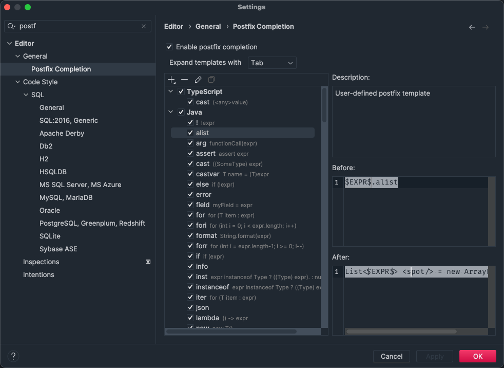
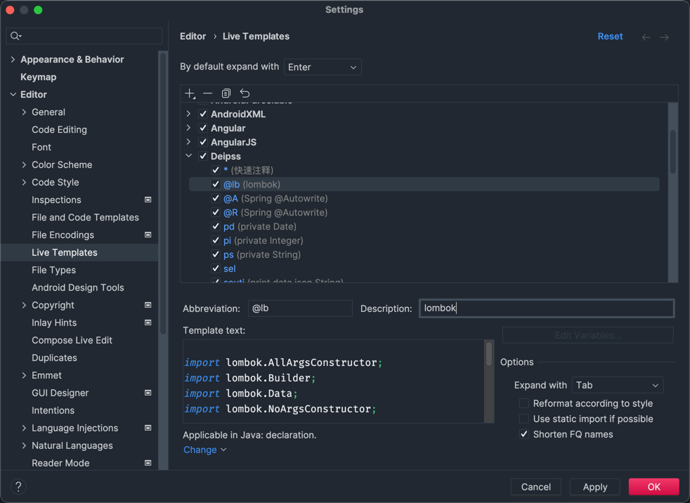
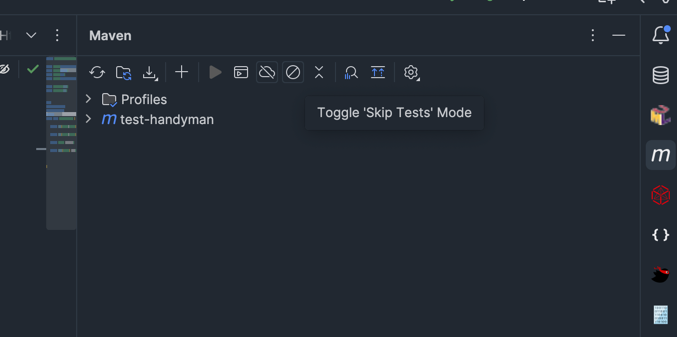
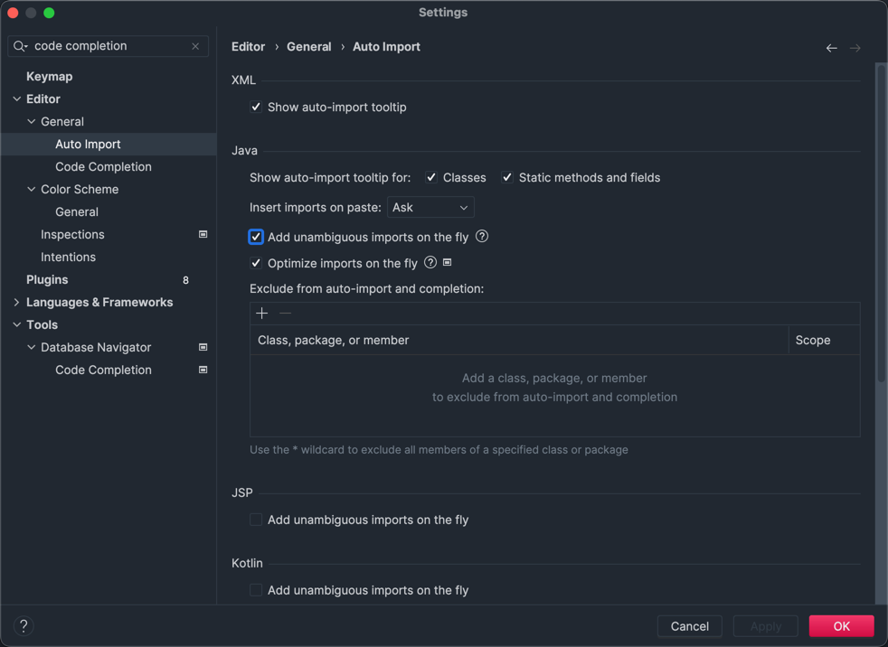

## 1. 编码提效

### 1.1. postfix

### 1.2. live template

### 1.3. maven builder

### 1.4. code completion

## 2. idea plugin

- alibaba arthas
- ASM插件 ASM Bytecode Outline
- database helper
- database navigator
- findbugs 代码扫描
- jclasslib
- JSON转领域对象工具：GsonFormat
- markdown
- markdown editor
- markdown index
- Maven辅助神器：Maven Helper
- MyBatisCodeHelperPro
- package check
- package search
- plant uml 画图工具
- RestfulToolkit : RESTFul 服务开发辅助工具集
- Spring Assistant
- VisualVM
- Vuesion Theme 主题
- 代码作色工具：Rainbow Brackets
- 代码注解插件：Lombok
- 代码生成工具：CodeMaker
- 代码缩略 code glance pro
- 单元测试测试生成工具：JUnitGenerator
- 字符串工具：String Manipulation
- 日志工具：Grep Console
- 时序图生成工具：SequenceDiagram
- 生成对象set方法：GenerateAllSetter
- 阿里代码规约检测
- 领域对象转JSON工具：POJO to JSON
- 驼峰转换：String manipulation
- 测试代码生成：Squaretest

以下是一个综合表格的整理结果，便于对比查看功能分类和描述：

| 插件名称                          | 功能分类                 | 详细功能描述                                                                 |
|-----------------------------------|--------------------------|------------------------------------------------------------------------------|
| **ASM Bytecode Viewer**           | 字节码分析               | 查看和分析 Java 字节码（ASM 框架相关），用于逆向工程、字节码调试等场景。         |
| **CodeGlance Pro**                | 代码导航                 | 在编辑器右侧生成代码缩略图（类似迷你地图），方便快速定位代码段落。               |
| **DatabaseHelper**                | 数据库管理               | 支持 SQL 编辑、表结构查看、数据可视化管理，简化数据库操作流程。                 |
| **GenerateAllSetter**             | 代码生成                 | 一键生成对象属性的链式 setter 代码，减少 POJO 对象赋值的样板代码。               |
| **GrepConsole**                   | 日志处理                 | 美化控制台日志输出，支持关键词高亮、级别过滤、分组显示，提升日志可读性。         |
| **Json Parser**                   | 数据解析                 | 格式化、验证 JSON 数据，支持 JSON 与 Java 对象互转（如生成 POJO 类）。            |
| **Kotlin**                        | 语言支持                 | IntelliJ 官方 Kotlin 插件，提供语法高亮、代码补全、调试等全流程开发支持。         |
| **MapStruct-Intellij-Plugin**     | 框架集成                 | 支持 MapStruct 注解（对象映射工具），提供代码生成预览、错误检查和映射关系可视化。 |
| **MavenHelper**                   | 构建工具                 | 查看 Maven 依赖关系、解决冲突、快速执行命令，提升 Maven 项目管理效率。             |
| **Mermaid**                       | 图表编辑                 | 在 IDE 中直接编辑和预览 Mermaid 流程图、状态图、甘特图等，辅助逻辑可视化。       |
| **MyBatisCodeHelper-Pro**          | 持久层框架               | MyBatis 增强插件，支持自动生成 SQL 映射文件、动态 SQL 预览及代码生成。            |
| **RestfulToolkit-fix**            | RESTful 开发              | 优化 RESTful 开发，支持接口搜索、URL 路径映射生成、注解补全，提升接口开发效率。   |
| **SequenceDiagram**               | 时序分析                 | 根据代码生成时序图（Sequence Diagram），直观展示方法调用流程和对象交互关系。     |
| **Shell Script**                  | 脚本开发                 | 提供 Shell 脚本语法高亮、代码补全、执行控制台，方便在 IDE 中编写和调试脚本。       |
| **StringManipulation**            | 字符串工具               | 支持大小写转换、编码转换、正则替换、JSON 格式化等多功能字符串处理。               |
| **VisualVMLauncher**              | 性能分析                 | 快速启动 VisualVM（JVM 性能分析工具），直接在 IDE 中监控线程、内存等运行状态。    |
| **api-generator-plus**            | 文档生成                 | 自动生成 Swagger 等 API 文档、接口测试代码，支持多格式导出（如 HTML/Markdown）。  |
| **aqua-plugin**                   | 界面主题                 | 提供 Aqua 风格 UI 主题（类似 macOS 原生界面），自定义 IDE 视觉风格。              |
| **arthas-idea-plugin**            | 应用诊断                 | 集成 Arthas（Java 诊断工具），支持在 IDE 中直接启动命令行进行性能调优和问题排查。 |
| **intellij-rainbow-brackets**      | 代码可读性               | 为代码括号（{} [] ()）添加彩虹色标记，清晰区分代码块层级，提升结构可读性。       |
| **jclasslib**                     | 类文件查看               | 查看 Java 类文件（.class）详细结构，包括常量池、字节码、属性、方法等元数据。     |
| **macOSKeymap**                   | 快捷键适配               | 将 IDE 快捷键映射为 macOS 系统默认风格，降低 macOS 用户的学习成本。               |
| **plantuml4idea**                 | UML 工具                  | 支持 PlantUML 图表编辑和预览，用于绘制类图、用例图、活动图等 UML 模型。           |
| **pojo2json**                     | 对象转换                 | 将 Java POJO 对象快速转换为 JSON 字符串，支持自定义序列化规则和格式调整。         |
| **spring-dubbo**                  | 微服务框架               | Spring 和 Dubbo 集成支持，提供服务配置高亮、注册发现管理，简化 Dubbo 开发流程。   |
| **spring-websocket**              | 通信框架                 | Spring WebSocket 开发辅助，支持配置可视化、消息调试，加速实时通信功能开发。      |
| **tongyi-jetbrains**              | 团队协作（推测）          | 可能为企业内部插件，用于统一开发规范、代码检查或团队协作管理（需结合具体场景）。 |
| **vaadin-endpoints**              | Web 框架                 | Vaadin（Java Web 框架）插件，支持组件开发、端点配置和调试，快速构建 Web 应用。   |

