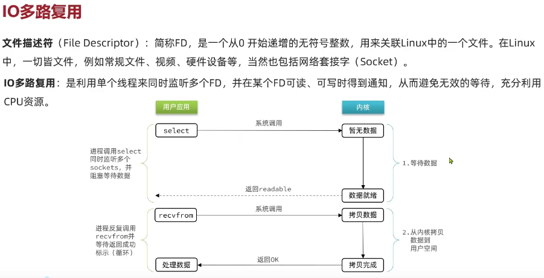
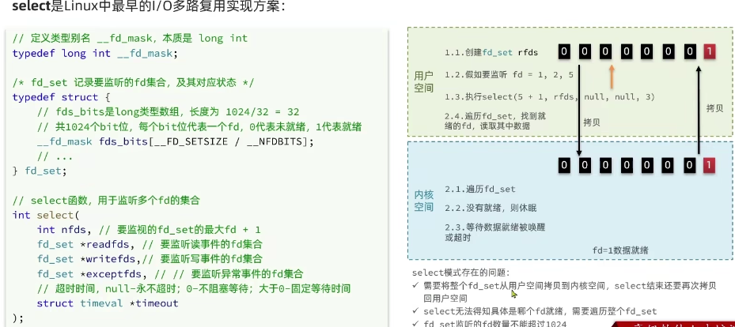
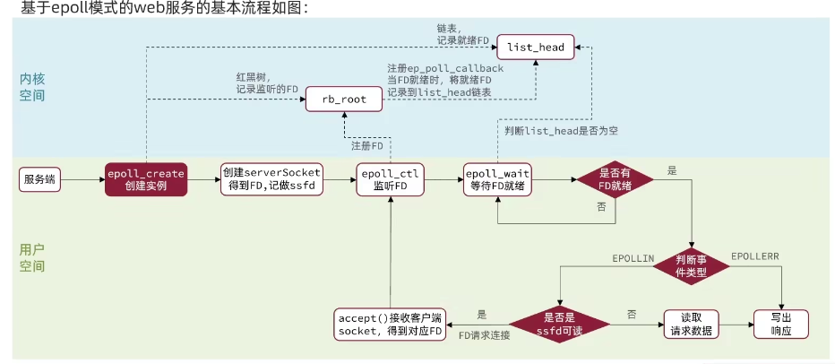
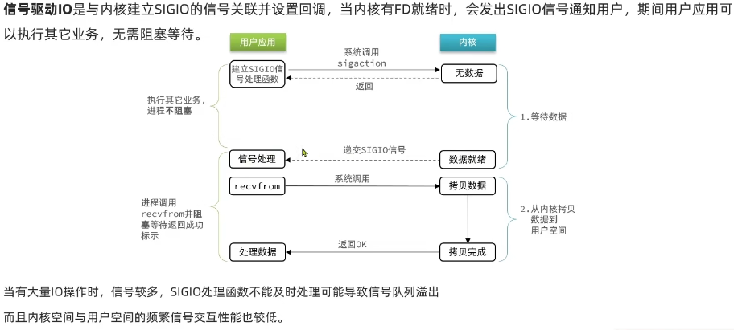
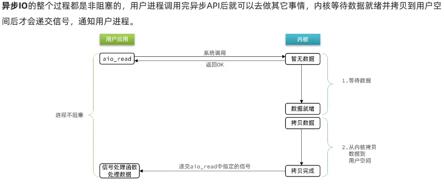
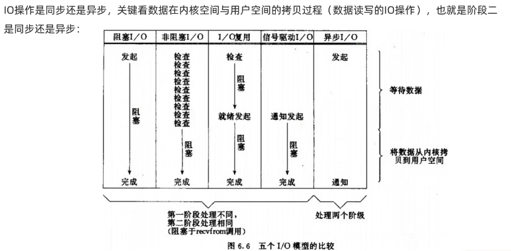
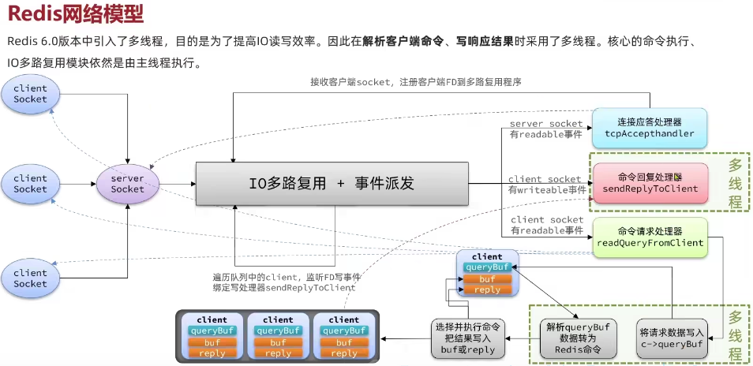
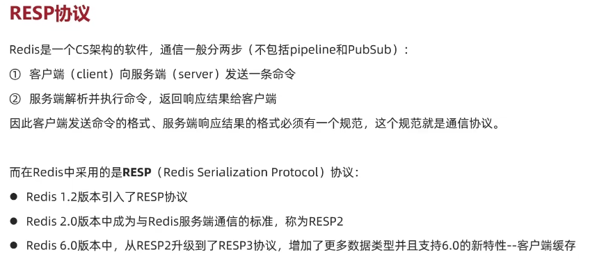
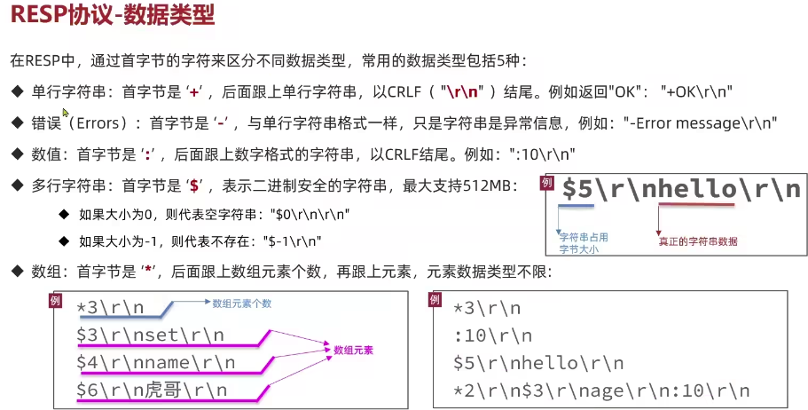

- 图片来源：https://www.bilibili.com/video/BV1cr4y1671t?p=160&vd_source=f52d9488d7d3c21ed33580e4dce1a022

# 1. 用户空间与内核空间

# 2. IO方式

## 2.1. 阻塞IO

## 2.2. 非阻塞IO

## 2.3. IO多路复用

### 2.3.1. select

### 2.3.2. poll

### 2.3.3. epoll

解决的问题：

- 使用红黑树保存要监听的FD
- 只拷贝一次FD到内核空间
- 内核将就绪的FD直接拷贝到用户空间，不再用户空间自己去遍历出哪个FD是就绪的

**epoll LT ET**

**epoll web server**

## 2.4. 信号驱动IO

## 2.5. 异步IO

# 3. 零COPY

因为使用mmap技术实现零拷贝，受到一定的内存大小限制，一般在1-2个G。
所以使用零拷贝技术的文件，大小一般在1G左右，
比如rocket MQ 的commit log文件就是1G一个。

# 4. 对比

# 5. 线程模型

- 只是核心业务（命令处理），是单线程，整体redis（AOF）是多线程
- 版本4.0 使用异步多线程的方式来执行删除命令
- 版本6.0 在网络通信中引入多线程，提高多核CPU的利用率

# 6. 为什么使用线程

- redis是纯内存（微秒），没有磁盘IO（毫秒），性能瓶颈是在网络延时，不是执行速度
- 上下文切换会有开销
- 要应对多线程不安全问题

# 7. redis 网络模型

# 8. redis 网络协议

# 9. redis 网络协议-数据类型

