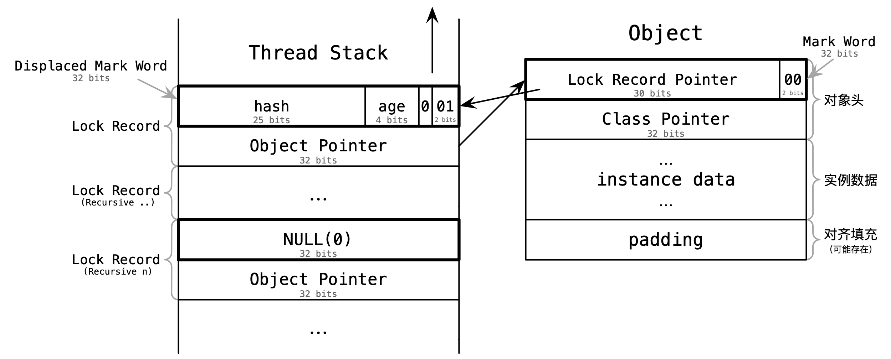

# 1. synchronized的实现

`synchronized` 是 Java 中实现同步的一种机制，它的底层实现完全依赖于 JVM（Java 虚拟机）的支持。在 JVM 中，
[synchronized 实现原理]( https://pdai.tech/md/db/sql-mysql/sql-mysql-b-tree.html)
`synchronized` 的实现涉及到对象头（Object Header）和 Monitor 机制。

- 对象头（Object Header）

在 JVM 中，每个对象都有一个对象头（Object Header），它包含了关于对象自身运行时的数据，
如哈希码（HashCode）、GC 分代年龄、锁状态标志、线程持有的锁、偏向线程 ID、偏向时间戳等。
这些信息被存储在 Mark Word（标记字段）中，而 `synchronized` 使用的锁就是存储在 Mark Word 中的。

- Monitor 机制

`synchronized` 的实现依赖于 Monitor 机制。Monitor 是 JVM 中的一个同步工具，
它可以被看作是一个同步原语。每个对象都有一个 Monitor 与之关联，当线程尝试获取对象的锁时，
实际上是尝试获取该对象的 Monitor 的所有权。

## 1.1. synchronized 的使用

1. **修饰实例方法**：当一个线程访问一个对象的 `synchronized` 实例方法时，
   JVM 会在该对象的对象头中加锁。其他线程尝试访问该对象的任何 `synchronized` 实例方法时，都会被阻塞，直到锁被释放。
2. **修饰静态方法**：当一个线程访问一个类的 `synchronized` 静态方法时，
   JVM 会在该类的 Class 对象上加锁。其他线程尝试访问该类的任何 `synchronized` 静态方法时，都会被阻塞，直到锁被释放。
3. **修饰代码块**：当一个线程访问一个 `synchronized(this)` 代码块时，
   JVM 会在当前对象的对象头上加锁。如果是 `synchronized(其他对象)`，则会在指定对象的对象头上加锁。

## 1.2. 性能开销

由于 `synchronized` 的实现涉及到对象头和 Monitor 机制，因此它会在一定程度上增加程序的性能开销。不过，由于 JVM
对 `synchronized` 进行了很多优化（如自旋锁、适应性自旋锁、偏向锁等），
因此在实际应用中，`synchronized` 的性能开销通常是可以接受的。

自旋锁、适应性自旋锁和偏向锁是 Java 虚拟机（JVM）中对 `synchronized` 关键字进行优化的几种机制，
这些机制都是为了减少线程在等待获取锁时的性能开销。下面分别介绍这三种锁机制：

### 1.2.1. 自旋锁（SpinLock）

自旋锁是一种非阻塞锁，它尝试通过循环检查锁是否被释放来避免线程挂起。
当线程尝试获取锁时，如果锁被其他线程持有，那么当前线程会进入一个循环，
不断检查锁是否可用。如果锁在短时间内被释放，那么当前线程可以立即获取到锁并继续执行，
从而避免了线程挂起和唤醒带来的性能开销。但如果锁被长时间持有，
那么自旋锁可能会导致当前线程浪费大量的CPU 时间。

### 1.2.2. 适应性自旋锁（Adaptive SpinLock）

为了解决自旋锁可能导致的 CPU 资源浪费问题，JVM 引入了适应性自旋锁。
适应性自旋锁会根据之前线程自旋等待锁成功的次数和自旋失败的次数来动态调整自旋的次数。
如果线程之前自旋等待锁成功的次数较多，那么JVM 会认为这次自旋也很可能成功，从而增加自旋的次数；
如果线程之前自旋等待锁失败的次数较多，那么 JVM会认为这次自旋很可能失败，从而减少自旋的次数或直接挂起线程。

### 1.2.3. 偏向锁（Biased Locking）

偏向锁是为了解决多线程环境中竞争不激烈的情况下的性能问题。
在大多数情况下，锁只有一个线程访问，因此 JVM会将锁偏向于第一个访问它的线程。
当第一个线程访问锁时，JVM 会将锁对象头中的 Mark Word 标记为偏向锁，
并记录持有偏向锁的线程ID。当这个线程再次访问锁时，不需要进行任何同步操作，
因为 JVM 已经知道这个线程已经持有了锁。只有当其他线程尝试访问这个锁时，才会触发偏向锁的撤销，升级为轻量级锁或重量级锁。

### 1.2.4. 总结

这三种锁机制都是为了提高 `synchronized` 的性能而引入的。
自旋锁通过避免线程挂起和唤醒来减少性能开销，但可能导致 CPU资源浪费；
适应性自旋锁通过动态调整自旋次数来平衡 CPU资源的使用和等待锁的开销；
偏向锁则通过减少无竞争情况下的同步操作来提高性能。
这些机制共同协作，使得 `synchronized`在不同场景下都能保持较好的性能。

## 1.3. 总结

`synchronized` 是 Java 中实现同步的一种重要机制，它依赖于 JVM 的对象头和 Monitor 机制来实现。虽然 `synchronized`
会在一定程度上增加程序的性能开销，但由于其简单易用和高效性，它仍然是 Java 中最常用的同步手段之一。

# 2. ReentrantLock的实现

`ReentrantLock` 是 Java `java.util.concurrent.locks` 包中的一个类，它提供了比内置的 `synchronized`
关键字更灵活和可扩展的锁机制。`ReentrantLock` 的实现依赖于 Java 内存模型以及底层的线程调度和同步机制。

下面是一些关于 `ReentrantLock` 实现的关键点：

### 2.1. 锁状态

`ReentrantLock` 使用一个整型的 `state`
字段来表示锁的状态。这个字段可以表示锁是否被某个线程持有，以及锁的重入次数。当 `state = 0`
时，表示锁没有被任何线程持有；当 `state > 0` 时，表示锁被持有，并且 `state` 的值表示重入的次数。

### 2.2. 同步队列

`ReentrantLock` 使用一个 `FairSync` 或 `NonfairSync` 内部类来实现同步，这些内部类继承自 `AbstractQueuedSynchronizer`
（AQS）。AQS 维护了一个 FIFO 队列（同步队列），用于存放等待获取锁的线程。当线程尝试获取锁失败时，它会被加入到这个队列中。

### 2.3. 公平锁与非公平锁

`ReentrantLock` 可以配置为公平锁或非公平锁。在公平锁模式下，线程按照它们请求锁的顺序来获取锁。
而在非公平锁模式下，线程可以抢占已经等待在队列中的线程之前获取锁。

### 2.4. 锁获取与释放

**获取锁**：当线程尝试获取锁时，它会首先检查锁是否可用（`state == 0`）。
如果可用，它会设置 `state` 为 1并返回。如果不可用，线程会尝试加入同步队列等待，直到它有机会获取锁。

**释放锁**：当线程释放锁时，它会将 `state` 减 1。如果 `state` 变为 0，表示锁已经完全释放，此时会从同步队列中唤醒一个等待的线程来尝试获取锁。

### 2.5. 条件变量

`ReentrantLock` 还支持条件变量，通过 `Condition` 对象来实现。
条件变量允许线程在等待某个条件成立时释放锁，让其他线程执行。
当条件满足时，线程可以再次获取锁并继续执行。

### 2.6. 中断支持

与 `synchronized` 不同，`ReentrantLock` 支持线程中断。
当线程在等待获取锁时被中断，`ReentrantLock`会感知到这个中断，并抛出 `InterruptedException`。

### 2.7. 总结

`ReentrantLock` 的实现比 `synchronized`
更复杂，因为它提供了更多的功能和灵活性。它使用内部状态来表示锁的状态，
使用同步队列来管理等待的线程，支持公平和非公平锁，以及条件变量和中断。
这些机制使得 `ReentrantLock`在高并发和复杂同步需求的场景下非常有用。

# 3. synchronized 和 ReentrantLock的区别

`synchronized` 和 `ReentrantLock` 都是 Java 中用于实现同步的机制，
但它们在实现方式、功能和性能上有一些区别。
 
## 3.1. synchronized

`synchronized` 是 Java 语言内置的关键字，用于控制多个线程对共享资源的访问。它可以用来修饰方法或代码块。

**特点：**

1. **内置支持**：`synchronized` 是 Java 语言的一部分，无需额外导入任何类。
2. **非公平锁**：默认情况下，`synchronized` 是非公平的，即等待时间最长的线程不一定会首先获得锁。
3. **无法中断**：一个正在等待 `synchronized` 锁的线程无法被中断。
4. **锁释放**：当线程退出 `synchronized` 代码块或方法时，锁会自动释放。
5. **性能开销**：`synchronized` 的性能开销相对较小，因为它不需要在运行时进行大量的方法调用。

## 3.2. ReentrantLock

`ReentrantLock` 是 Java `java.util.concurrent.locks` 包中的一个类，提供了比 `synchronized` 更灵活的锁机制。

**特点：**

1. **灵活性**：`ReentrantLock` 提供了更多的灵活性，比如可以设置公平锁或非公平锁，
   支持可重入（一个线程可以多次获取同一个锁），支持锁的中断等。
2. **公平性**：通过构造函数，`ReentrantLock` 可以设置为公平锁，此时等待时间最长的线程会首先获得锁。
3. **可中断性**：正在等待 `ReentrantLock` 的线程可以被中断。
4. **锁状态查询**：`ReentrantLock` 提供了方法可以查询锁的状态，例如是否被某个线程持有等。
5. **条件变量**：`ReentrantLock` 还支持条件变量（通过 `Condition` 对象），可以在等待某个条件成立时释放锁，让其他线程执行。
6. **性能开销**：由于 `ReentrantLock` 的实现需要更多的方法调用和对象创建，因此相比 `synchronized`
   ，其性能开销可能会更大。但在某些高并发场景下，`ReentrantLock` 可能会提供更好的性能和更灵活的控制。

## 3.3. 总结

选择使用 `synchronized` 还是 `ReentrantLock` 取决于具体的应用场景和需求。
对于简单的同步需求，`synchronized`通常是一个更好的选择，因为它更简单、更高效。
但对于需要更复杂的同步控制、公平性、可中断性等功能时，`ReentrantLock` 可能是一个更好的选择。