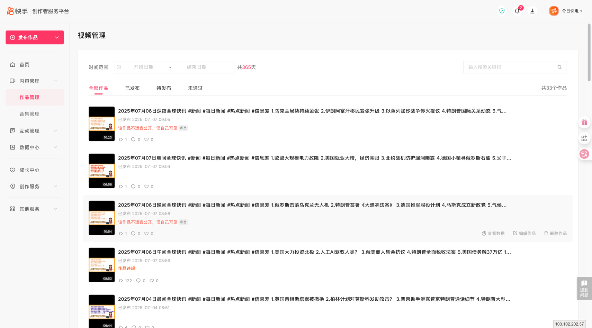
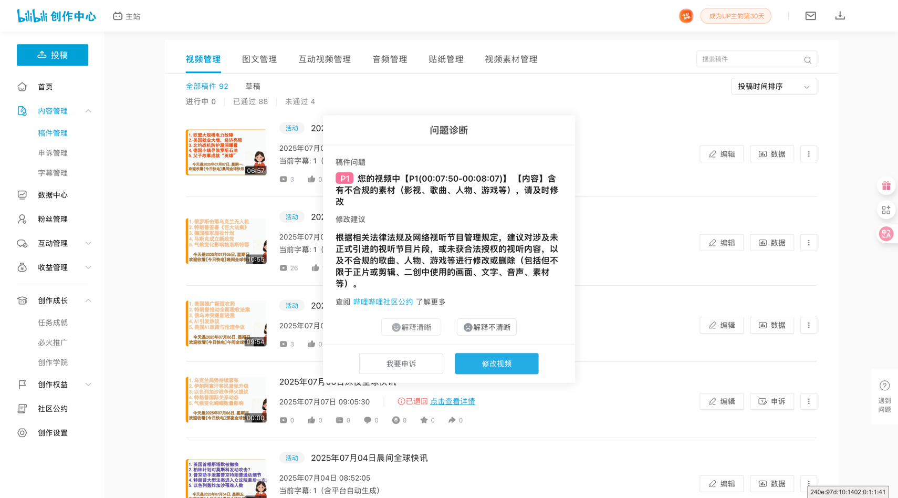
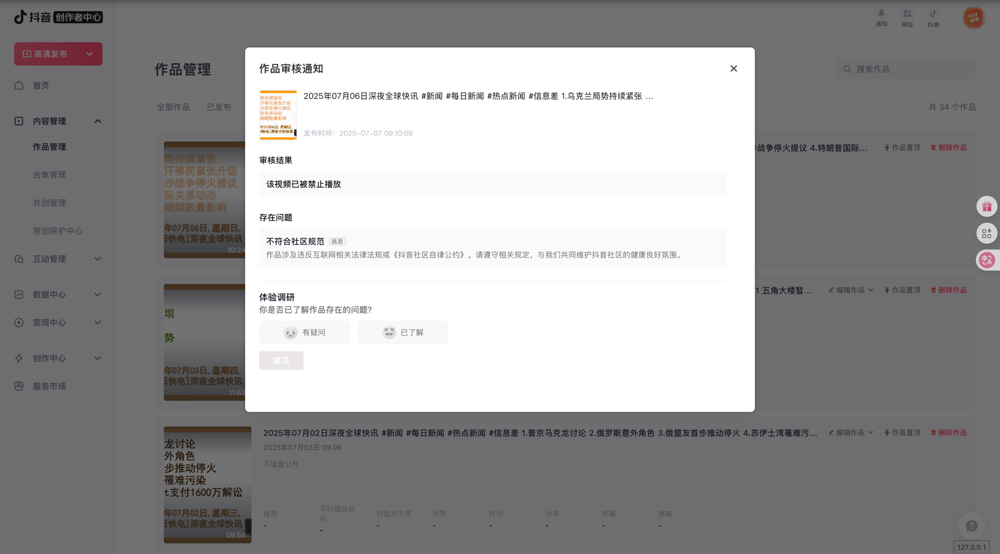

# 新闻类赛道上的收集


上图是搜索关键字是`信息差`返回的结果，可以看出，达到10粉丝的有前5名。破万粉丝的有11名。


上图是搜索关键字是`新闻`返回的结果，可以看出，达到10粉丝的有前13名。破万粉丝就许多。


这个UP主从3月20号，到6月29号，三个月的时间，就有20W粉丝。所以可以对标这个账号。

一直没有搜索国外其他主流平台，

---

# 风险的预警

其实在做全球的实讯方面的内容，信息方面的风险是很多的，包括；

- 1 内容版权方面的权益
- 2 信息合规方面的内容（政治敏感、内容暴力等）

除了最主要的两方面的内容风险以外，还有外部的同行竞争、恶意举报等等。

2025-6-30就被小红书下架了3个视频，原因是【信息并未公布】

## 各平台的审核制度

### 快手

是比较严格的，**2025年7月的第一周，快手直接把账号封禁了**


### 小红书

没有快手严格，但是也不轻松，对于搬运新闻的审查很严格

```text
账号审核详情
平台：今日快电 / 小红书号：96xxxx6420
处置结果：警告

存在问题：

根据《规则百科》，账号下存在违反相关政策或规定的内容：

在未获得官方认证的情况下，自行编写新闻稿件并发布的行为

在未获得官方认证的情况下，以新闻形式进行内容发布的行为

在未获得官方认证的情况下，批量转载新闻信息的行为

其他违反平台规则的内容
```

### B站
没有快手那么严格



### 抖音
强度和快手差不多

```text
处置项目：

限制历史作品仅自己可见（15天）
处置周期：2025-07-10 09:42 至 2025-07-25 09:42

禁止修改个人资料（15天）
处置周期：2025-07-10 09:42 至 2025-07-25 09:42

重置个人资料
处置时间：2025-07-10 09:42（不具有持续效应）

存在问题：仿冒新闻媒体账号

账号可能存在“仿冒新闻媒体”的行为，包括但不限于：

账号个人资料中假冒、仿冒或捏造新闻媒体的名称和标识，或使用具有新闻属性的名称、标识

账号未经许可大量发布社会热点、国内外时政和本地新闻等新闻信息

改进建议：

立即修改账号昵称、头像等个人资料，停止使用与新闻机构或节目近似的名称和标识

删除账号内已有违规新闻内容


```



