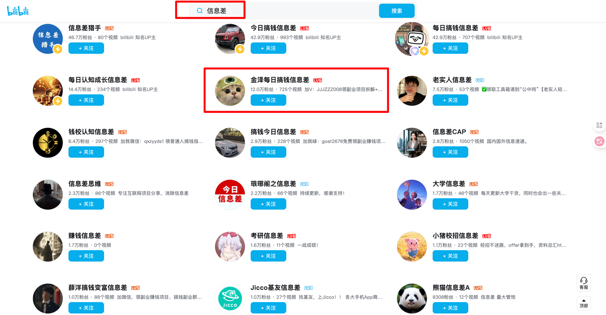
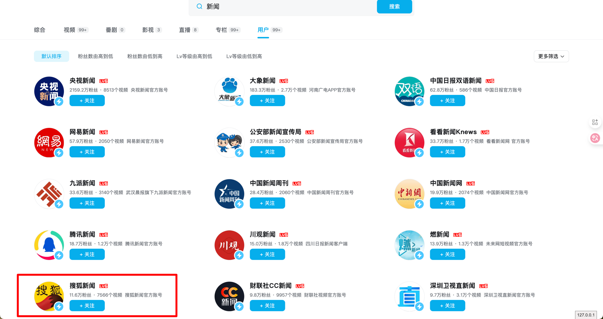
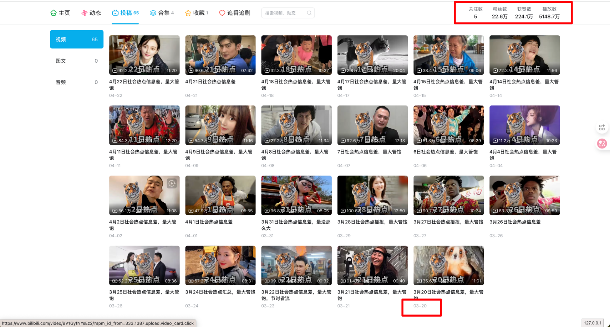

# 新闻类赛道上的收集

上图是搜索关键字是`信息差`返回的结果，可以看出，达到10粉丝的有前5名。破万粉丝的有11名。

上图是搜索关键字是`新闻`返回的结果，可以看出，达到10粉丝的有前13名。破万粉丝就许多。

这个UP主从3月20号，到6月29号，三个月的时间，就有20W粉丝。所以可以对标这个账号。

一直没有搜索国外其他主流平台，
# 风险的预警

其实在做全球的实讯方面的内容，信息方面的风险是很多的，包括；
- 1 内容版权方面的权益
- 2 信息合规方面的内容（政治敏感、内容暴力等）

除了最主要的两方面的内容风险以外，还有外部的同行竞争、恶意举报等等。

2025-6-30就被小红书下架了3个视频，原因是【信息并未公布】