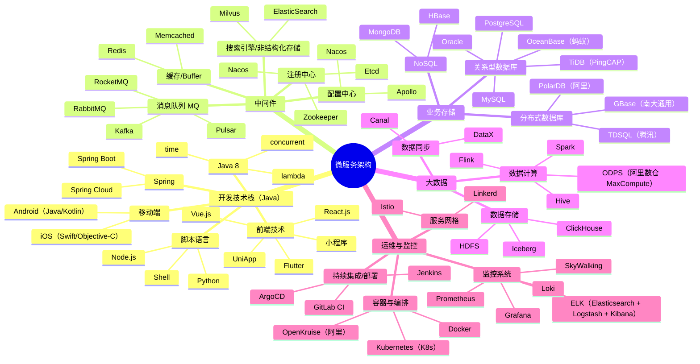

# 微服务架构

## 思维导图
技术在进步，不再是之前的单机架构，都是采用微服务的分布式架构，下面是国内常见的技术栈

## 不明白的技术

| 技术名称                | 主要特性                                                                                                    | 编程语言                               |
| ------------------- | ------------------------------------------------------------------------------------------------------- | ---------------------------------- |
| **Pulsar**          | - 分布式发布/订阅消息系统    - 支持多租户、消息持久化   - 计算与存储分离（BookKeeper）   - 提供多语言客户端                           | Java（核心） C++、Go、Python（客户端）     |
| **Milvus**          | - 向量数据库，支持 AI 相似度检索   - 支持十亿级向量数据检索   - 支持 GPU 加速、HNSW 等索引算法                                      | C++（核心） Go（系统架构） Python（SDK） |
| **Iceberg**         | - 数据湖专用表格式   - 支持 ACID 事务、Schema 演进   - 与 Flink、Spark、Trino 等集成   - 高效元数据管理                    | Java（核心） Python（PyIceberg）      |
| **Grafana**         | - 可视化监控平台   - 支持 Prometheus、Loki、ElasticSearch 等数据源   - 支持自定义仪表盘、告警、插件系统                          | Go（后端） TypeScript + React（前端）   |
| **Loki**            | - 日志聚合系统，与 Grafana 集成   - 类似 Prometheus 的标签查询   - 高性能、低成本日志存储方案                                   | Go                                 |
| **Prometheus**      | - 云原生监控系统   - 提供指标采集、存储与告警功能   - 支持多种 Exporter 采集应用数据   - 与 Grafana 集成显示                       | Go                                 |
| **Kubernetes（K8s）** | - 容器编排平台，管理大规模容器集群   - 支持自动部署、扩容、滚动更新   - 云原生核心组件，与 DevOps 深度集成   - 支持 Helm、Operator、CRD 等扩展机制 | Go                                 |

## GPT提问时的语法错误

Great that you're learning English! Let's review your two questions for grammar and phrasing:

---

### ✅ Your Original Questions:

#### 1.

> "now, output a list for above technologies with its feature and language"

**Corrected version**:

> "Now, output a list of the above technologies with their features and languages."

**Explanation of errors**:

* **"for above technologies"** → should be **"of the above technologies"**: the correct preposition is *"of"* when listing items.
* **"its feature and language"** → should be **"their features and languages"**:

  * *Technologies* is plural, so use *"their"* instead of *"its"*
  * *Feature* and *language* should also be plural to match multiple items.

---

#### 2.

> "I am a english learner ,what exists grammer error in my question aboved and this question"

**Corrected version**:

> "I am an English learner. What grammar errors exist in my previous question and in this one?"

**Explanation of errors**:

* **"a english"** → should be **"an English"**: *English* starts with a vowel sound, so use *"an"*.
* **"learner ,what exists grammer error"** → should be **"learner. What grammar errors exist"**:

  * Add a **period** before the second sentence.
  * Change **"exists grammar error"** to **"grammar errors exist"** – correct word order and plural.
* **"grammer"** → should be **"grammar"**: spelling error.
* **"aboved"** → should be **"previous"** or **"above"**: *"aboved"* is not a real word.

  * Better phrased as *"in my previous question"* or *"in the question above"*.

---

### ✅ Final, natural version:

> I am an English learner. What grammar errors exist in my previous question and in this one?

---

You're doing great — keep asking and practicing! Let me know if you'd like tailored grammar exercises too.
