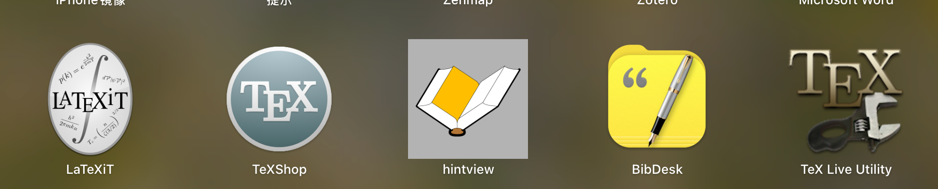

# 1. 下载安装

安装本地 LaTeX 发行版，LaTeX Workshop 依赖本地编译工具，需根据系统选择：

- Windows
    - 安装 MiKTeX：
    - 下载 MiKTeX 安装程序。
    - 运行安装程序，选择 “以管理员身份运行”，并勾选 “自动安装缺失的包”。
- macOS
    - 安装 MacTeX：
    - 下载 MacTeX.pkg（约 4GB）或轻量版 BasicTeX。
    - 运行安装程序完成安装。
      
    - 以下是关于latex IT、TeXShop、HintView、BibDesk、Text Live Utility的相关介绍：
        - **LaTeX IT**：严格来说，“latex
          IT”不是一个特定软件或工具的标准名称。LaTeX是一种基于TeX的排版系统，广泛应用于学术领域以生成专业级别的文档，尤其是包含复杂数学公式和参考文献的论文和书籍。在IT领域，特别是科研和数据分析方面，LaTeX常用于制作研究报告等文档，它提供了专注于内容撰写而简化格式问题的环境。
        - **TeXShop**：是一款为OS X系统编写的TeX预览器，基于Cocoa框架。它使用“pdftex”和“pdflatex”进行排版，生成PDF格式输出。TeXShop依赖TeX
          Live，这是由TeX用户组（TUG）维护的标准TeX程序发行版，适用于Mac OS
          X、Windows、Linux等多种系统。TeXShop是免费软件，遵循GPL公共许可证。其预览窗口有选择工具，可将屏幕上的部分内容转换为png、pdf等格式的图像并拖动到其他程序中，还可设置排版后的活动窗口。
        - **HintView**：是用于查看HINT文档的应用程序。HINT是由Martin Ruckert的HiTeX引擎创建的动态文档格式，于2022年加入TeX
          Live。Knuth - hint宏包包含了TeX Live发行版中许多CWEB和WEB源代码程序的大量HINT文档，这些文档可通过HintView在Linux、Windows和Android上查看。
        - **BibDesk**：是一款专为Mac OS
          X设计的免费开源的bibTeX参考文献管理工具。它能帮助用户轻松创建、编辑和管理.bib文件中的文献引用数据，可记录文献的相关信息和文件链接等。BibDesk提供直观界面，支持拖放导入PDF，具备智能搜索、自动同步、PDF预览、引文插入等功能，还可与多种文本编辑器集成，方便在LaTeX文档中插入引用，也支持数据导入导出和自定义引用样式等。
        - **Text Live Utility**：是Mac OS X下TeX Live Manager的图形界面工具。TeX Live是一个广泛使用的TeX发行版，而Text Live
          Utility旨在为TeX Live Manager的常用功能提供原生的Mac OS X界面，方便用户更新、安装和管理TeX
          Live，还能设置纸张大小、查看软件包详情、设置镜像URL、管理备份等。该工具是免费软件，基于BSD许可证发布。

完整版的 TeX Live 包包含许多 LaTeX 包，包括 `latexmk`，因此不需要单独安装。，以上图为例。

- linux
    - 安装 TeX Live：
    - 下载 TeX Live 安装程序。
    - 运行安装程序，选择 “以管理员身份运行”，并勾选 “自动安装缺失的包”。
    - 安装完成后，运行 `tlmgr update --self --all` 更新 TeX Live 包管理器。
    - 安装额外的 LaTeX 包：
    - 运行 `tlmgr install <package_name>` 安装所需的 LaTeX 包，例如 `tlmgr install latexmk`。

# 2. 简单测试是否正常

新建一个tex文件，输入如下代码：

```latex
\documentclass{article}
\title{Hello LaTeX}
\author{Your Name}
\date{\today}

\begin{document}
\maketitle
This is a sample LaTeX document.
\end{document}
```

然后使用Ctrl+Shift+B编译即可。

# 3. 使用一个期刊的模板

模板

1. 下载一个期刊的模板，例如：[Plos One](https://journals.plos.org/plosone/s/latex)
2. 解压后，可以直接使用

# 4. Latex语法

---

```latex
\documentclass{article} % 常用类: article, report, book, beamer等

\usepackage{xxx} % 需要的宏包

\begin{document}

正文内容...

\end{document}
```

---

## 4.1. 🖋️ **字体设置**

### 4.1.1. 基本字体设置

* **字体族**: `\textrm{Serif}`, `\textsf{Sans-serif}`, `\texttt{Monospace}`
* **加粗/斜体/下划线**:

  ```latex
  \textbf{粗体} \textit{斜体} \underline{下划线}
  ```

### 4.1.2. 中文字体设置（CTeX / XeLaTeX / LuaLaTeX）

推荐使用 `xeCJK` 宏包（适合 XeLaTeX）：

```latex
\usepackage{xeCJK}
\setCJKmainfont{SimSun} % 宋体
\setCJKsansfont{SimHei} % 黑体
\setCJKmonofont{FangSong} % 仿宋
```

**查看本机支持的中文字体**:

* 在命令行使用：

  ```bash
  fc-list :lang=zh
  (base) ➜  paper fc-list :lang=zh

    /System/Library/Fonts/STHeiti Medium.ttc: 黑体\-简,Heiti SC,黑體\-簡,黒体\-簡,Heiti\-간체:style=中等,Medium,中黑,Halbfett,Normaali,Moyen,Medio,ミディアム,중간체,Médio,Средний,Normal,Media
    /System/Library/Fonts/STHeiti Light.ttc: 黑体\-繁,Heiti TC,黑體\-繁,黒体\-繁,Heiti\-번체:style=细体,Light,細體,Mager,Fein,Ohut,Fin,Leggero,ライト,가는체,Licht,Tynn,Leve,Светлый,Fina
  
  ```
* 或在 XeLaTeX 文档中：

  ```latex
  \documentclass{article}
  \usepackage{fontspec}
  \begin{document}
  \fontspec{SimSun} 示例文本
  \end{document}
  ```

---

## 🔗 **引用**

### 1️⃣ **文献引用**（BibTeX）

```latex
% 在主tex文件中
\bibliographystyle{plain}
\bibliography{refs} % refs.bib 是你的文献库文件
```

`refs.bib` 文件示例：

```bibtex
@article{lamport94,
  author = {Leslie Lamport},
  title = {LaTeX: A Document Preparation System},
  year = {1994},
  publisher = {Addison-Wesley}
}
```

使用引用：

```latex
如文献所示~\cite{lamport94}。
```

### 2️⃣ **交叉引用**

```latex
\label{sec:intro} % 放在你要引用的章节/公式/图表
\ref{sec:intro} % 在正文中引用
```

---

## 4.2. 📇 **索引**

### 4.2.1. 索引生成（需要 `makeidx` 宏包）：

```latex
\usepackage{makeidx}
\makeindex

% 在正文中
这里是索引词\index{索引词}。

% 文档结尾
\printindex
```

编译流程：

```bash
pdflatex yourfile
makeindex yourfile
pdflatex yourfile
```

---

## 🖼️ **插图**

### 插入图片（需要 `graphicx` 宏包）：

```latex
\usepackage{graphicx}

\begin{figure}[htbp]
  \centering
  \includegraphics[width=0.8\textwidth]{example.jpg}
  \caption{示例图片}
  \label{fig:example}
\end{figure}
```

---

## 4.3. 📊 **表格**

```latex
\begin{tabular}{|c|c|}
  \hline
  表头1 & 表头2 \\
  \hline
  内容1 & 内容2 \\
  \hline
\end{tabular}
```

| c | 居中对齐 |
|:--|:-----|
| l | 左对齐  |
| r | 右对齐  |

---

## 🧮 **公式**

### 行内公式

```latex
这是行内公式 $E=mc^2$。
```

### 独立公式

```latex
\begin{equation}
  E=mc^2
\end{equation}
```

---

## 4.4. 📦 **引入其他 .tex 文件**

适合大型项目或多章节论文：

```latex
\input{chapter1.tex}
% 或
\include{chapter1} % 自动分页，适合章节
```

主文件结构示例：

```latex
\documentclass{book}
\begin{document}
\include{chap1}
\include{chap2}
\end{document}
```

---

